# Data Model — Joidy

This document describes the database schema used by Joidy. The schema is
defined by SQLAlchemy ORM models in [`api/models/`](api/models/) and managed
through Alembic migrations in [`api/alembic/versions/`](api/alembic/versions/).

> **Source of truth:** The code in `api/models/*.py` and the Alembic migrations
> are the authoritative definition of the schema. This document is a
> human-readable reference and may lag behind the code. When in doubt, read the
> models and migrations.

The database is a single PostgreSQL 16 instance with the `pgvector` extension
(enabled for vector embeddings). All tables live in the same database
(`DATABASE_URL`).

---

## Enums

These Python `enum.Enum` (subclassing `str`) types back SQLAlchemy `Enum`
columns.

### `GoalTemporality` (`api/models/goal.py`)
| Value | Description |
|-------|-------------|
| `DAILY` | Daily goal |
| `WEEKLY` | Weekly goal |
| `MONTHLY` | Monthly goal |
| `ANNUAL` | Annual goal |

### `GoalMeasurement` (`api/models/goal.py`)
| Value | Description |
|-------|-------------|
| `COUNT` | Measured by count |
| `BOOLEAN` | Done / not done |
| `PERCENT` | Measured as percentage |

### `GoalState` (`api/models/goal.py`)
| Value | Description |
|-------|-------------|
| `ACTIVE` | In progress |
| `COMPLETED` | Finished successfully |
| `FAILED` | Failed |
| `PAUSED` | Temporarily paused |
| `CANCELLED` | Cancelled |

### `GoalFailConfig` (`api/models/goal.py`)
| Value | Description |
|-------|-------------|
| `STATIC` | Static failure behaviour |
| `ROLLOVER` | Rollover on failure |
| `SNOWBALL` | Snowball accumulation |

### `GitHubRepoStatus` (`api/models/github.py`)
| Value | Description |
|-------|-------------|
| `ACTIVE` | Repo is being synced |
| `PAUSED` | Sync paused |
| `DISABLED` | Sync disabled |

### `GitHubItemType` (`api/models/github.py`)
| Value | Description |
|-------|-------------|
| `ISSUE` | GitHub issue |
| `PR` | Pull request |
| `COMMIT` | Commit |

### `GitHubSyncStatus` (`api/models/github.py`)
| Value | Description |
|-------|-------------|
| `SYNCED` | Item synced |
| `PENDING` | Sync pending |
| `FAILED` | Sync failed |

### `GitHubEventType` (`api/models/github.py`)
| Value | Description |
|-------|-------------|
| `issues` | Issue event |
| `pull_request` | Pull request event |
| `issue_comment` | Issue comment event |
| `push` | Push event |

---

## Tables

### `notes` — `Note` (`api/models/note.py`)
| Column | Type | Notes |
|--------|------|-------|
| `id` | Integer | PK, indexed |
| `title` | String(500) | not null |
| `content` | Text | default `""` |
| `source` | String(50) | default `"joidy"` (`joidy` \| `obsidian`) |
| `source_path` | String(1000) | nullable, indexed |
| `is_embedded` | Boolean | default `False` |
| `created_at` | DateTime | server default `now()` |
| `updated_at` | DateTime | server default `now()`, onupdate `now()` |

**Relationships:** `tags` → `NoteTag` (cascade `all, delete-orphan`).

### `note_embeddings` — `NoteEmbedding` (`api/models/note.py`)
| Column | Type | Notes |
|--------|------|-------|
| `note_id` | Integer | PK, FK → `notes.id` (CASCADE) |
| `embedding` | Vector(768) | pgvector, Gemini embedding size |

### `tags` — `Tag` (`api/models/note.py`)
| Column | Type | Notes |
|--------|------|-------|
| `id` | Integer | PK, indexed |
| `name` | String(100) | unique, not null |
| `parent_id` | Integer | nullable, FK → `tags.id` (SET NULL) |
| `color` | String(20) | default `"#888888"` |
| `created_at` | DateTime | server default `now()` |

**Relationships:** `notes` → `NoteTag` (cascade `all, delete-orphan`);
`children` / `parent` self-referential.

### `note_tags` — `NoteTag` (`api/models/note.py`)
| Column | Type | Notes |
|--------|------|-------|
| `note_id` | Integer | PK, FK → `notes.id` (CASCADE) |
| `tag_id` | Integer | PK, FK → `tags.id` (CASCADE) |
| `confidence` | Float | default `1.0` (1.0 = manual, <1.0 = AI) |
| `source` | String(20) | default `"manual"` (`manual` \| `ai`) |

**Relationships:** `note` → `Note`; `tag` → `Tag`.

### `note_links` — `NoteLink` (`api/models/note.py`)
| Column | Type | Notes |
|--------|------|-------|
| `source_note_id` | Integer | PK, FK → `notes.id` (CASCADE) |
| `target_note_id` | Integer | PK, FK → `notes.id` (CASCADE) |
| `context_text` | Text | nullable |

**Relationships:** `source_note` / `target_note` → `Note` (backrefs
`out_links` / `in_links`).

### `tag_cooccurrences` — `TagCooccurrence` (`api/models/note.py`)
| Column | Type | Notes |
|--------|------|-------|
| `tag_a_id` | Integer | PK, FK → `tags.id` (CASCADE) |
| `tag_b_id` | Integer | PK, FK → `tags.id` (CASCADE) |
| `weight` | Integer | default `0` |
| `updated_at` | DateTime | server default `now()`, onupdate `now()` |

### `embedding_failures` — `EmbeddingFailure` (`api/models/note.py`)
| Column | Type | Notes |
|--------|------|-------|
| `note_id` | Integer | PK, FK → `notes.id` (CASCADE) |
| `attempts` | Integer | default `0` |
| `last_error` | Text | default `""` |
| `next_retry_at` | DateTime | nullable |
| `updated_at` | DateTime | server default `now()`, onupdate `now()` |

### `sync_state` — `SyncState` (`api/models/sync_state.py`)
| Column | Type | Notes |
|--------|------|-------|
| `id` | Integer | PK, indexed |
| `note_id` | Integer | unique, FK → `notes.id` (CASCADE), not null |
| `last_synced_at` | DateTime | nullable |
| `local_mtime` | DateTime | nullable |
| `remote_mtime` | DateTime | nullable |
| `conflict` | Boolean | default `False`, not null |
| `created_at` | DateTime | server default `now()` |
| `updated_at` | DateTime | server default `now()`, onupdate `now()` |

**Relationships:** `note` → `Note` (backref `sync_state`).

### `goals` — `Goal` (`api/models/goal.py`)
| Column | Type | Notes |
|--------|------|-------|
| `id` | Integer | PK, indexed |
| `title` | String(500) | not null |
| `description` | Text | default `""` |
| `temporality` | Enum(`GoalTemporality`) | default `DAILY` |
| `measurement_type` | Enum(`GoalMeasurement`) | default `COUNT` |
| `target_value` | Float | default `1.0` |
| `current_value` | Float | default `0.0` |
| `max_assignment_days` | Integer | nullable |
| `state` | Enum(`GoalState`) | default `ACTIVE` |
| `fail_config` | Enum(`GoalFailConfig`) | default `STATIC` |
| `fail_emoji` | String(20) | default `"🔴"` |
| `color` | String(20) | default `"#c8a96e"` |
| `theme` | String(20) | default `"solid"` |
| `note_id` | Integer | nullable, FK → `notes.id` (SET NULL) |
| `tag_id` | Integer | nullable, FK → `tags.id` (SET NULL) |
| `parent_id` | Integer | nullable, FK → `goals.id` (SET NULL) |
| `pending_removal` | Boolean | default `False` |
| `is_completed` | Boolean | default `False` |
| `completed_at` | DateTime | nullable |
| `source_path` | String(1000) | nullable |
| `created_at` | DateTime | server default `now()` |
| `updated_at` | DateTime | server default `now()`, onupdate `now()` |

**Relationships:** `tag` → `Tag`; `note` → `Note`; self-referential
`parent_id`.

### `planning_assignments` — `PlanningAssignment` (`api/models/planning.py`)
| Column | Type | Notes |
|--------|------|-------|
| `id` | Integer | PK, indexed |
| `date` | Date | not null, indexed |
| `goal_id` | Integer | not null, FK → `goals.id` (CASCADE) |
| `created_at` | DateTime | server default `None` |

**Relationships:** `goal` → `Goal`.

### `skills` — `Skill` (`api/models/skill.py`)
| Column | Type | Notes |
|--------|------|-------|
| `id` | Integer | PK, indexed |
| `tag_id` | Integer | unique, FK → `tags.id` (CASCADE) |
| `note_count` | Integer | default `0` |
| `level` | String(20) | default `"locked"` (`locked` \| `apprentice` \| `journeyman` \| `expert` \| `master`) |
| `xp` | Integer | default `0` |
| `first_unlocked_at` | DateTime | nullable |
| `updated_at` | DateTime | server default `now()`, onupdate `now()` |

**Relationships:** `tag` → `Tag`.

> Level thresholds (`SKILL_LEVELS`): apprentice 3–9, journeyman 10–24,
> expert 25–49, master 50+. Below 3 notes the skill is `locked`.

### `personal_streaks` — `PersonalStreak` (`api/models/personal_streaks.py`)
| Column | Type | Notes |
|--------|------|-------|
| `id` | Integer | PK, autoincrement |
| `name` | String | not null |
| `emoji` | String | default `"🔥"` |
| `icon` | String | default `""` (Lucide icon name) |
| `description` | String | default `""` |
| `color` | String | default `""` |
| `theme` | String | default `"solid"` (`solid` \| `gradient` \| `glow` \| `minimal`) |
| `category` | String | default `"general"` |
| `start_date` | Date | nullable |
| `target_date` | Date | nullable |
| `offset` | Integer | default `0` (migration offset) |
| `frequency` | String | default `"daily"` (`daily` \| `every_n`) |
| `frequency_days` | Integer | default `1` |
| `is_archived` | Boolean | default `False` |
| `best_streak` | Integer | default `0` |
| `total_checkins` | Integer | default `0` |
| `freeze_count` | Integer | default `0` (available shields) |
| `freeze_used` | Integer | default `0` (shields used) |
| `created_at` | DateTime | default `now()` |

**Relationships:** `checkins` → `StreakCheckIn` (cascade `all, delete-orphan`,
ordered by `check_date`).

### `streak_checkins` — `StreakCheckIn` (`api/models/personal_streaks.py`)
| Column | Type | Notes |
|--------|------|-------|
| `id` | Integer | PK, autoincrement |
| `streak_id` | Integer | not null, FK → `personal_streaks.id` (CASCADE) |
| `check_date` | Date | not null |
| `note` | String | default `""` |
| `mood` | Integer | nullable (1–5) |
| `created_at` | DateTime | default `now()` |

**Constraints:** `UniqueConstraint("streak_id", "check_date")`.

**Relationships:** `streak` → `PersonalStreak`.

### `xp_events` — `XPEvent` (`api/models/gamification.py`)
| Column | Type | Notes |
|--------|------|-------|
| `id` | Integer | PK, indexed |
| `event_type` | String(100) | not null |
| `xp` | Integer | not null |
| `metadata_json` | String(500) | default `"{}"` |
| `created_at` | DateTime | server default `now()` |

### `streak_records` — `StreakRecord` (`api/models/gamification.py`)
| Column | Type | Notes |
|--------|------|-------|
| `id` | Integer | PK, indexed |
| `activity_date` | Date | unique, not null |
| `xp_earned` | Integer | default `0` |
| `created_at` | DateTime | server default `now()` |

### `user_stats` — `UserStats` (`api/models/gamification.py`)
Singleton row (`id` defaults to `1`).

| Column | Type | Notes |
|--------|------|-------|
| `id` | Integer | PK, default `1` |
| `total_xp` | Integer | default `0` |
| `current_streak` | Integer | default `0` |
| `longest_streak` | Integer | default `0` |
| `plant_stage` | Integer | default `0` (0–6) |
| `last_activity_date` | Date | nullable |
| `updated_at` | DateTime | server default `now()`, onupdate `now()` |

### `system_config` — `SystemConfig` (`api/models/config.py`)
| Column | Type | Notes |
|--------|------|-------|
| `id` | Integer | PK, indexed |
| `key` | String | unique, indexed, not null |
| `value` | String | nullable |
| `updated_at` | DateTime | default `now()`, onupdate `now()` |

### `push_subscriptions` — `PushSubscription` (`api/models/push_subscription.py`)
| Column | Type | Notes |
|--------|------|-------|
| `id` | Integer | PK, indexed |
| `user_id` | Integer | not null, indexed |
| `endpoint` | String | not null |
| `p256dh` | String | not null |
| `auth` | String | not null |
| `created_at` | DateTime | server default `now()` |

### `github_repos` — `GitHubRepo` (`api/models/github.py`)
| Column | Type | Notes |
|--------|------|-------|
| `id` | Integer | PK, indexed |
| `name` | String(200) | not null |
| `full_name` | String(200) | unique, not null |
| `description` | Text | nullable |
| `url` | String(500) | not null |
| `default_branch` | String(100) | default `"main"` |
| `is_private` | Boolean | default `False` |
| `status` | Enum(`GitHubRepoStatus`) | default `ACTIVE` |
| `webhook_id` | Integer | nullable |
| `webhook_secret` | String(100) | nullable |
| `last_synced_at` | DateTime | nullable |
| `created_at` | DateTime | server default `now()` |
| `updated_at` | DateTime | server default `now()`, onupdate `now()` |

### `github_items` — `GitHubItem` (`api/models/github.py`)
| Column | Type | Notes |
|--------|------|-------|
| `id` | Integer | PK, indexed |
| `repo_id` | Integer | not null, FK → `github_repos.id` (CASCADE) |
| `external_id` | Integer | not null, indexed |
| `item_type` | Enum(`GitHubItemType`) | not null |
| `number` | Integer | not null |
| `title` | String(500) | not null |
| `body` | Text | default `""` |
| `state` | String(20) | default `"open"` |
| `state_reason` | String(50) | nullable |
| `author` | String(100) | default `""` |
| `assignee` | String(100) | nullable |
| `labels` | String(500) | default `""` |
| `url` | String(500) | not null |
| `html_url` | String(500) | not null |
| `goal_id` | Integer | nullable, FK → `goals.id` (SET NULL) |
| `note_id` | Integer | nullable, FK → `notes.id` (SET NULL) |
| `synced_at` | DateTime | server default `now()` |
| `created_at` | DateTime | server default `now()` |
| `updated_at` | DateTime | server default `now()`, onupdate `now()` |

**Relationships:** `repo` → `GitHubRepo`; `goal` → `Goal`.

### `github_events` — `GitHubEvent` (`api/models/github.py`)
| Column | Type | Notes |
|--------|------|-------|
| `id` | Integer | PK, indexed |
| `repo_id` | Integer | not null, FK → `github_repos.id` (CASCADE) |
| `event_type` | Enum(`GitHubEventType`) | not null |
| `action` | String(50) | not null |
| `sender` | String(100) | not null |
| `item_type` | Enum(`GitHubItemType`) | nullable |
| `item_number` | Integer | nullable |
| `item_external_id` | Integer | nullable |
| `payload` | JSON | default `dict` |
| `processed` | Boolean | default `False` |
| `created_at` | DateTime | server default `now()` |

**Relationships:** `repo` → `GitHubRepo`.

### `google_tokens` — `GoogleToken` (`api/models/google_token.py`)
Single-user app: only one row (`user_id` defaults to `1`, unique). The refresh
token is encrypted with Fernet using the app's `SECRET_KEY`.

| Column | Type | Notes |
|--------|------|-------|
| `id` | Integer | PK, indexed |
| `user_id` | Integer | not null, default `1`, unique |
| `access_token` | Text | nullable |
| `refresh_token_encrypted` | Text | nullable |
| `token_type` | String | default `"Bearer"`, not null |
| `expires_at` | DateTime | nullable |
| `scope` | Text | nullable |
| `created_at` | DateTime | server default `now()` |
| `updated_at` | DateTime | server default `now()`, onupdate `now()` |

---

## Entity-Relationship Diagram

```mermaid
erDiagram
    notes ||--o{ note_tags : "has"
    tags   ||--o{ note_tags : "has"
    notes ||--o{ note_links : "source"
    notes ||--o{ note_links : "target"
    tags  ||--o{ tags : "parent"
    notes ||--|| note_embeddings : "embedded"
    notes ||--o{ embedding_failures : "fails"
    notes ||--o| sync_state : "synced"

    tags ||--o{ tag_cooccurrences : "tag_a"
    tags ||--o{ tag_cooccurrences : "tag_b"

    tags   ||--o| skills : "tracks"
    goals  }o--o| notes : "note_id"
    goals  }o--o| tags  : "tag_id"
    goals  }o--o| goals : "parent_id"
    goals  ||--o{ planning_assignments : "assigned"
    goals  ||--o{ github_items : "goal_id"
    notes  ||--o{ github_items : "note_id"

    github_repos ||--o{ github_items : "contains"
    github_repos ||--o{ github_events : "receives"

    personal_streaks ||--o{ streak_checkins : "checkins"

    notes {
        integer id PK
        string title
        text content
        string source
        string source_path
        boolean is_embedded
        datetime created_at
        datetime updated_at
    }
    note_embeddings {
        integer note_id PK
        vector embedding
    }
    tags {
        integer id PK
        string name
        integer parent_id
        string color
        datetime created_at
    }
    note_tags {
        integer note_id PK
        integer tag_id PK
        float confidence
        string source
    }
    note_links {
        integer source_note_id PK
        integer target_note_id PK
        text context_text
    }
    tag_cooccurrences {
        integer tag_a_id PK
        integer tag_b_id PK
        integer weight
        datetime updated_at
    }
    embedding_failures {
        integer note_id PK
        integer attempts
        text last_error
        datetime next_retry_at
        datetime updated_at
    }
    sync_state {
        integer id PK
        integer note_id
        datetime last_synced_at
        datetime local_mtime
        datetime remote_mtime
        boolean conflict
        datetime created_at
        datetime updated_at
    }
    goals {
        integer id PK
        string title
        text description
        enum temporality
        enum measurement_type
        float target_value
        float current_value
        integer max_assignment_days
        enum state
        enum fail_config
        string fail_emoji
        string color
        string theme
        integer note_id
        integer tag_id
        integer parent_id
        boolean pending_removal
        boolean is_completed
        datetime completed_at
        string source_path
        datetime created_at
        datetime updated_at
    }
    planning_assignments {
        integer id PK
        date date
        integer goal_id
        datetime created_at
    }
    skills {
        integer id PK
        integer tag_id
        integer note_count
        string level
        integer xp
        datetime first_unlocked_at
        datetime updated_at
    }
    personal_streaks {
        integer id PK
        string name
        string emoji
        string icon
        string description
        string color
        string theme
        string category
        date start_date
        date target_date
        integer offset
        string frequency
        integer frequency_days
        boolean is_archived
        integer best_streak
        integer total_checkins
        integer freeze_count
        integer freeze_used
        datetime created_at
    }
    streak_checkins {
        integer id PK
        integer streak_id
        date check_date
        string note
        integer mood
        datetime created_at
    }
    xp_events {
        integer id PK
        string event_type
        integer xp
        string metadata_json
        datetime created_at
    }
    streak_records {
        integer id PK
        date activity_date
        integer xp_earned
        datetime created_at
    }
    user_stats {
        integer id PK
        integer total_xp
        integer current_streak
        integer longest_streak
        integer plant_stage
        date last_activity_date
        datetime updated_at
    }
    system_config {
        integer id PK
        string key
        string value
        datetime updated_at
    }
    push_subscriptions {
        integer id PK
        integer user_id
        string endpoint
        string p256dh
        string auth
        datetime created_at
    }
    github_repos {
        integer id PK
        string name
        string full_name
        text description
        string url
        string default_branch
        boolean is_private
        enum status
        integer webhook_id
        string webhook_secret
        datetime last_synced_at
        datetime created_at
        datetime updated_at
    }
    github_items {
        integer id PK
        integer repo_id
        integer external_id
        enum item_type
        integer number
        string title
        text body
        string state
        string state_reason
        string author
        string assignee
        string labels
        string url
        string html_url
        integer goal_id
        integer note_id
        datetime synced_at
        datetime created_at
        datetime updated_at
    }
    github_events {
        integer id PK
        integer repo_id
        enum event_type
        string action
        string sender
        enum item_type
        integer item_number
        integer item_external_id
        json payload
        boolean processed
        datetime created_at
    }
    google_tokens {
        integer id PK
        integer user_id
        text access_token
        text refresh_token_encrypted
        string token_type
        datetime expires_at
        text scope
        datetime created_at
        datetime updated_at
    }
```

---

## Notes

- **pgvector:** The `note_embeddings.embedding` column uses `Vector(768)`,
  matching the Gemini embedding dimension. This requires the `pgvector`
  extension, which is enabled in the PostgreSQL container.
- **Single-user app:** `user_stats` is a singleton (`id = 1`) and
  `google_tokens` holds a single row (`user_id = 1`).
- **Cascade behaviour:** Most foreign keys to `notes` and `tags` use
  `CASCADE` for child records (e.g. `note_tags`, `note_embeddings`) and
  `SET NULL` for optional references (e.g. `goals.note_id`,
  `github_items.goal_id`).
- **Indexes:** Primary keys and explicitly `index=True` columns are indexed
  automatically by SQLAlchemy. Unique constraints (e.g. `tags.name`,
  `github_repos.full_name`, `streak_checkins(streak_id, check_date)`) also
  create indexes.
