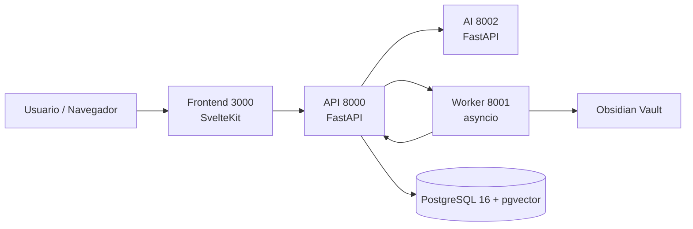

# Joidy — Quick Start / Dev Onboarding

Guía simplificada para poner en marcha Joidy en local y entender los
servicios principales.

## Requisitos

- Docker + Docker Compose
- Git
- Opcional: una carpeta de Obsidian existente para el vault

## 1. Clonar y configurar

```bash
git clone https://github.com/Axel-DaMage/joidy.git
cd joidy
```

Copia el archivo de configuración de ejemplo y complétalo:

```bash
cp .env.example .env
```

Variables obligatorias:

| Variable | Descripción | Ejemplo |
|----------|-------------|---------|
| `SECRET_KEY` | Clave para firmar sesiones | `openssl rand -hex 32` |
| `OBSIDIAN_VAULT_PATH` | Ruta absoluta a tu vault | `/home/usuario/Documents/Obsidian` |
| `GEMINI_API_KEY` | API key de Google AI Studio | `...` |

Variables opcionales: `GITHUB_TOKEN`, `TELEGRAM_BOT_TOKEN`, etc.

## 2. Levantar los servicios

```bash
make setup   # crea .env si no existe, directorios de datos y permisos
make dev     # inicia frontend, api, ai-service y worker con hot reload
```

Tras unos segundos la app estará en:

| Servicio | URL |
|----------|-----|
| Frontend | http://localhost:3000 |
| API docs | http://localhost:8000/docs |

Para parar:

```bash
make stop
```

## 3. Flujo de trabajo diario

```bash
make dev        # levanta todo
make logs       # ver logs en tiempo real
make test       # ejecuta tests de api y frontend
make migrate    # aplica migraciones de base de datos
```

## 4. Arquitectura simplificada



## 5. Estructura del repositorio

```
.
├── api/              # FastAPI: REST, auth, gamificación, integraciones
├── ai-service/       # Servicio de embeddings/clasificación con Gemini
├── worker/           # Tareas en background: sync vault, daily writes
├── frontend/         # SvelteKit + Vite
├── data/             # Base de datos y archivos de subida (no commitear)
├── docker-compose.yml
└── Makefile
```

## 6. Primeros pasos en la app

1. Abre http://localhost:3000.
2. Si es la primera vez, elige contraseña maestra o accede con la configurada en `.env`.
3. Crea una nota desde `/notes`.
4. Crea una racha desde `/streaks`.
5. Abre Ajustes y configura tus integraciones en la sección "Integraciones".

## 7. Desarrollo sin Docker (no recomendado)

Si prefieres correr sin Docker, necesitas:

- Node 20+ en `frontend/`: `npm install && npm run dev`
- Python 3.12+ en `api/`: `pip install -r requirements.txt && uvicorn main:app --reload --port 8000`
- Python 3.12+ en `ai-service/`: `pip install -r requirements.txt && uvicorn main:app --reload --port 8002`
- Worker: `python main.py` dentro de `worker/`

Recuerda que la base de datos PostgreSQL (con la extensión `pgvector`) se comparte entre servicios vía `DATABASE_URL`, así que necesitas una instancia accesible (local o remota).

## 8. Convenciones útiles

- Cada servicio tiene su propio `README.md`. La arquitectura general está en `docs/`.
- El frontend usa Svelte stores en `frontend/src/lib/stores/`.
- El backend separa `routers/` (HTTP), `services/` (lógica) y `models/` (SQLAlchemy).
- `make lint` ejecuta `python -m compileall` en todos los servicios Python.

## 9. Resolución de problemas comunes

| Síntoma | Solución |
|---------|----------|
| `svelte-kit sync` falla por permisos | `make fix-permissions` |
| La base de datos no tiene tablas | `make migrate` |
| AI no responde | Revisa `GEMINI_API_KEY` en `.env` y los logs de `ai-service` |
| No se sincroniza el vault | Verifica `OBSIDIAN_VAULT_PATH` y permisos de lectura/escritura |

---

Para más detalles técnicos del frontend ver `docs/frontend.md`.
Para la arquitectura general ver `docs/architecture.md`.
Para el esquema de base de datos ver `docs/database.md`.
Para el índice completo de documentación ver `docs/index.md`.
