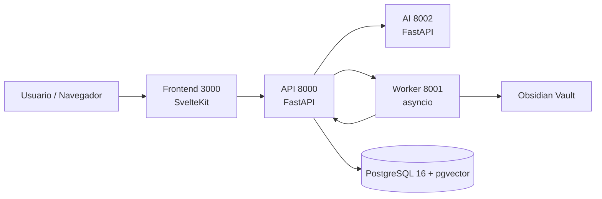

<p align="center">
  
</p>

<p align="center">
  <a href="https://github.com/Axel-DaMage/joidy/actions/workflows/ci.yml">
    
  </a>
  <a href="LICENSE">
    
  </a>
  <a href="https://github.com/Axel-DaMage/joidy/releases">
    
  </a>
  <a href="https://github.com/Axel-DaMage/joidy/discussions">
    
  </a>
</p>

<p align="center">
  <a href="https://joidy-web.vercel.app/">Web App</a>
  &middot;
  <a href="#docker">Docker</a>
  &middot;
  <a href="#curl">curl</a>
  &middot;
  <a href="#homebrew">Homebrew</a>
  &middot;
  <a href="#aur">AUR</a>
</p>

Personal knowledge management system with gamification. Manage notes, goals, streaks, and skills through a web dashboard with AI-powered features.

---

## Installation

**Prerequisito:** [Docker](https://docs.docker.com/get-started/get-docker/) (incluye Docker Compose).

### Linux / macOS

```bash
curl -fsSL https://raw.githubusercontent.com/Axel-DaMage/joidy/development/scripts/install.sh | bash
```

Clona el repo, genera secretos automáticamente e instala el comando `joidy`. Luego:

```bash
joidy up        # Inicia todos los servicios
# Abre http://localhost:3000
```

### Windows

Docker Desktop en Windows requiere WSL2. El camino más simple:

```powershell
# 1. Instala WSL2 con Ubuntu (como Administrador, una sola vez):
wsl --install
# 2. Reinicia y abre Ubuntu desde el menú de inicio, luego pega:
#    curl -fsSL https://raw.githubusercontent.com/Axel-DaMage/joidy/development/scripts/install.sh | bash
```

> PowerShell nativo (sin WSL2): `irm https://raw.githubusercontent.com/Axel-DaMage/joidy/development/scripts/install.ps1 | iex`

### Otros métodos

```bash
# Homebrew
brew tap Axel-DaMage/homebrew-tap && brew install joidy

# AUR (Arch Linux)
yay -S joidy

# Manual
git clone https://github.com/Axel-DaMage/joidy.git && cd joidy && cp .env.example .env && docker compose up -d
```

→ Guía completa de instalación: [INSTALL.md](INSTALL.md)

---

## Requirements

- [Docker](https://docs.docker.com/get-started/get-docker/) + Docker Compose
- **Windows:** WSL2 (`wsl --install`) — necesario para Docker Desktop

→ Ver [INSTALL.md](INSTALL.md) para instrucciones detalladas por plataforma.

---

## Configuration

Edit `.env` after cloning:

| Variable | Description | Source |
|----------|-------------|--------|
| `GEMINI_API_KEY` | AI service key | [Google AI Studio](https://aistudio.google.com/app/apikey) |
| `OBSIDIAN_VAULT_PATH` | Path to your Obsidian vault | e.g. `/home/user/Documents/Obsidian` |
| `OBSIDIAN_WEBHOOK_SECRET` | Shared secret for Obsidian webhook auth | Optional, any random string |
| `SECRET_KEY` | Session signing key | Auto-generated on first setup |

Optional:

```env
GITHUB_TOKEN=          # GitHub sync
GITHUB_USERNAME=
TELEGRAM_BOT_TOKEN=    # Notifications
TELEGRAM_ALLOWED_USER_ID=
```

---

## Usage

| Service | URL |
|---------|-----|
| Web App | http://localhost:3000 |
| API Docs | http://localhost:8000/docs |

### Development

```bash
make dev       # Hot reload, source mounts
make stop      # Stop all services
make logs      # View logs
make test      # Run tests
make migrate   # Database migrations
```

### Obsidian Webhook Sync

Joidy supports bidirectional sync with Obsidian. In addition to the local
file watcher (worker), you can configure Obsidian to push changes via webhook
for instant sync without polling.

#### Setup

1. Set `OBSIDIAN_WEBHOOK_SECRET` in `.env` to a random string
2. Configure an Obsidian plugin (e.g. [Obsidian Webhook](https://github.com/)) to send events to:

```
POST http://localhost:8000/webhook/obsidian?secret=YOUR_SECRET
```

#### Payload format

```json
{
  "event": "create",
  "path": "/vault/My Note.md",
  "content": "---\ntitle: My Note\ntags: [python, web]\n---\n# Content here",
  "mtime": 1700000000
}
```

| Field | Type | Required | Description |
|-------|------|----------|-------------|
| `event` | string | yes | `create`, `update`, or `delete` |
| `path` | string | yes | File path (matches `source_path` in DB) |
| `content` | string | create/update | Full file content (frontmatter + body) |
| `mtime` | int | no | Remote modification time (Unix timestamp) |

#### Events

- **create**: Creates a new note in the DB. Extracts title from frontmatter or filename, tags from frontmatter + inline `#tags`.
- **update**: Updates existing note by `source_path`. If not found, creates it instead.
- **delete**: Deletes the note matching `source_path`. No-op if not found.

#### Authentication

- If `OBSIDIAN_WEBHOOK_SECRET` is set: requests must include `?secret=<secret>` query param
- If not set but `AUTH_PASSWORD` is configured: JWT auth required
- If neither is set (dev mode): no auth required

#### Legacy endpoint

`POST /webhook/obsidian/legacy` — accepts the old payload format (`note_id`, `path`, `remote_mtime`) for backward compatibility. Only records sync state without processing content.

---

## Architecture

```
.
├── api/              FastAPI REST backend
├── ai-service/       AI service (Gemini, OpenAI, etc.)
├── worker/           Background tasks (Obsidian sync, daily summaries)
├── frontend/         SvelteKit web application
├── data/             Database, uploads, vault
├── docker-compose.yml
└── Makefile
```



---

## Quick Start

See [QUICKSTART.md](QUICKSTART.md) for a step-by-step dev onboarding guide.

## Documentation

- [Instalación detallada](./INSTALL.md)
- [Architecture](./docs/architecture.md)
- [Architecture Decision Records](./docs/adr/README.md)
- [Frontend Architecture](./docs/frontend.md)
- [Database](./docs/database.md)
- [Troubleshooting](./docs/troubleshooting.md)
- [Full docs index](./docs/index.md)

## License

GNU General Public License v3.0. See [LICENSE](LICENSE).
